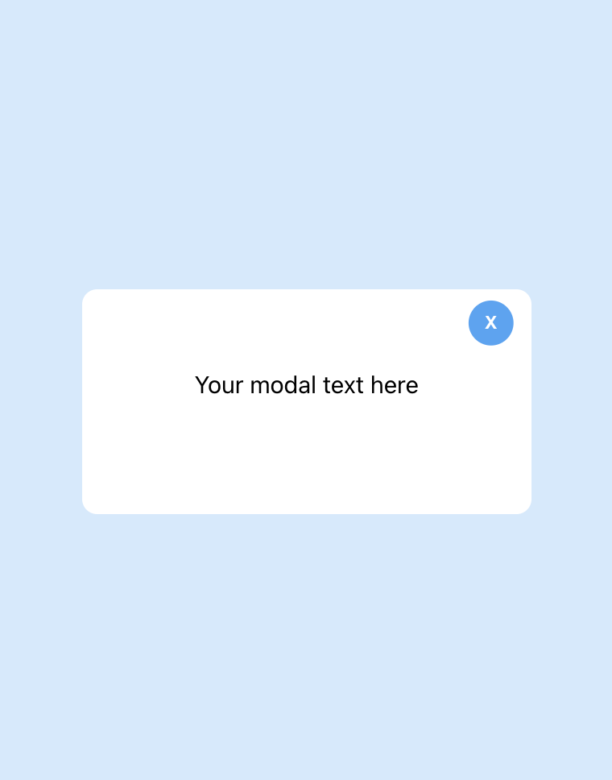
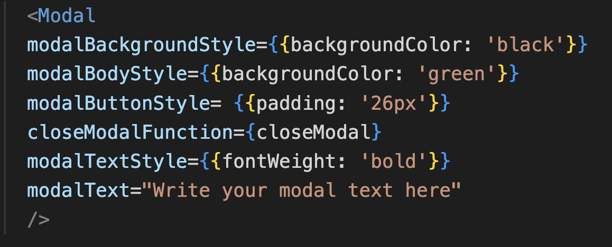

# react-modal-jcto

A simple responsive and customizable modal for React projects

## 1. Author

Jean Chane-to

## 2. Installation

npm install react-modal-jcto

## 3. Usage

Styling and text content is passed on the compnent via 5 props:

modalBackgroundStyle: pass inline styling for modal background

modalBodyStyle: pass inline styling for modal body

modalButtonStyle: pass inline styling for modal close button

closeModalFunction: point your modal close function

modalTextStyle: pass inline styling for modal text

modalText: pass you modal text as a string 

## 3. Example

Hope this helps!

Happy programming!